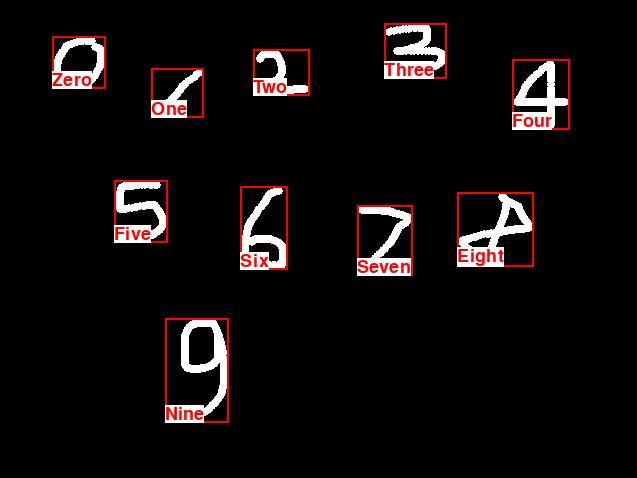

# Handwritten-Digit-Recognition
Ho provato due modelli diversi per il train di questa AI. il primo si trova in **MNIST_Train.ipynb** ed è un modello sequenziale.    
Il secondo invece è nel file **MNIST_Functional_model.ipynb** e come suggerisce il nome è un modello funzionale, creato per provare a trainare il modello con i feedback dell'utente sulle predizioni errate, ma non portato avanti.
Il modello lavora con un accuracy del **99%**, basato sul dataset del MNIST.    

Qui un esempio delle prediction del modello mentre l'utente stava utilizzando l'app.
 
